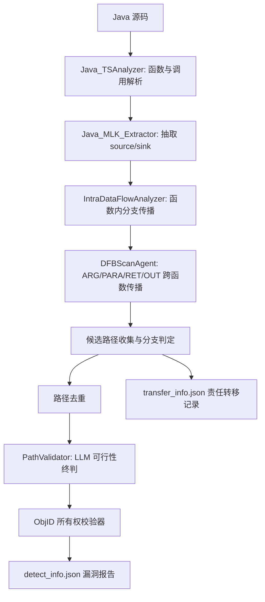
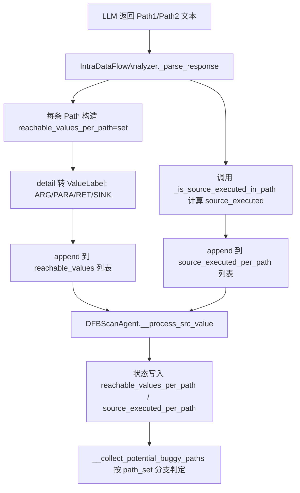

# Java MLK 检测规则与流程（当前实现）

本文档总结了 RepoAudit 中 **当前版本** 的 Java 资源泄露（MLK）检测逻辑。  
对应实现主要在以下文件：

- `src/tstool/dfbscan_extractor/Java/Java_MLK_extractor.py`
- `src/tstool/analyzer/Java_TS_analyzer.py`
- `src/agent/dfbscan.py`
- `src/tstool/validator/java_resource_ownership_validator.py`
- `src/llmtool/dfbscan/intra_dataflow_analyzer.py`
- `src/llmtool/dfbscan/path_validator.py`

---

## 1. 检测范围与目标

当前 Java MLK 关注的是 **显式生命周期资源泄露**（当前实现）：

- 资源被创建/获取（`source`）
- 资源应该被释放（`sink`）
- 若存在可行路径使资源最终未关闭，则判定为漏洞候选

目前覆盖的主要资源语义类型：

- `autocloseable`：流/连接/通道等显式 close 语义资源
- `lock`：`lock/acquire` 与 `unlock/release` 配对
- `executor`：线程池生命周期（`shutdown/shutdownNow/close`）
- `temp_resource`：临时文件/目录清理（`delete/deleteIfExists/deleteOnExit`）
- `transaction`：事务/会话资源（`begin/getTransaction/openSession` 与 `commit/rollback/close`）
- `subscription`：注册/订阅型资源（`register/subscribe/addListener` 与 `unregister/unsubscribe/removeListener`）
- `process`：进程句柄资源（`exec/start/spawn` 与 `destroy/waitFor/close`）

当前不覆盖：

- 对象滞留型泄露（静态缓存/集合、监听器、ThreadLocal 等）
- 没有显式 close 语义的 GC 压力型问题

---

## 2. 总体流程图



---

## 3. Source/Sink 抽取规则

### 3.1 Source 抽取

`Java_MLK_Extractor.extract_sources(...)` 合并三类来源：

1. `new Xxx(...)` 且 `Xxx` 被识别为资源类型
2. 工厂方法调用（如 `newInputStream`、`getConnection`、`prepareStatement`、`executeQuery` 等），并且返回值赋给资源类型变量
3. try-with-resources 资源声明

关键去重逻辑：

- `_is_wrapped_inner_creation(...)` 会抑制“嵌套包装中的内层构造”
- 例如：`new BufferedReader(new InputStreamReader(...))`，内层 `InputStreamReader` 不重复报 source

### 3.2 Sink 抽取

`Java_MLK_Extractor.extract_sinks(...)` 合并两类：

1. 显式释放调用：`close`、`abort`、`disconnect`、`shutdown`、`release`、`stop`
2. try-with-resources 的隐式关闭（合成 sink）

---

## 4. 函数级防“串流”（同名函数误连边）

`Java_TSAnalyzer` 使用更精细的函数标识和调用解析：

- 函数唯一标识：`function_uid = package.class.method(param_types)`
- 调用点匹配综合使用：
  - 方法名 + 参数个数
  - receiver 类型推断
  - 实参类型过滤
  - import/package/上下文裁剪

作用：减少同名重载或不同类同名方法之间的误连边。

---

## 5. 跨函数传播语义

在 `DFBScanAgent.__update_worklist(...)` 中，核心跨函数边为：

- `ARG -> PARA`：调用者实参传到被调者形参
- `RET -> OUT`：被调者返回值传回调用点左值
- `PARA -> ARG`：在 Java MLK 中被**禁用**（避免 helper 函数导致循环/重复路径）

直观理解：Java MLK 重点保留前向传播，减少反向副作用传播噪声。

---

## 6. 路径判定主规则（详细）

核心函数：`DFBScanAgent.__collect_potential_buggy_paths(...)`

Java MLK 按 `path_set`（每个分支路径）独立判定。

### 6.1 先分两类：空 `path_set` 与非空 `path_set`

#### A) 空 `path_set`

- 若该分支 source 未执行（`source_executed == False`）：忽略
- 若命中“返回分支未执行 source”启发式：忽略
- 否则（MLK 语义下）：
  - 可能生成“空分支候选路径”，并加入 marker：
    - `__NO_SINK_BRANCH_PATH_{idx}__`
  - 但若识别为“纯透传空分支”，则抑制不上报

#### B) 非空 `path_set`

将分支内传播点分为三类：

- `sink_edges`：出现 `ValueLabel.SINK`
- `continue_edges`：外部映射存在（`external_match_snapshot[(value,ctx)]` 非空）
- `terminal_edges`：`ARG/PARA/RET/OUT` 这类边界值，但没有外部映射继续传播

### 6.2 非空分支的优先级

Java MLK 当前优先级是：

1. 有 `sink_edges`：该分支视为已关闭，分支终止
2. 否则有 `continue_edges`：递归跨函数继续追踪
3. 否则有 `terminal_edges`：进入责任分类（Case1/2/3）

### 6.3 三种终止场景（Case1/Case2/Case3）

#### Case 1：对象未真实转移到外部

- 分类为 `no_real_transfer`
- 该分支作为泄露候选保留

常见例子：

- 打印/日志类参数使用
- 资源包装构造器参数（视为包装，不视为所有权移交）

#### Case 2：对象真实转移到外部，但外部映射链路中断

- 分类为 `ownership_transfer`
- 记入 `transfer_info.json`
- 不作为当前漏洞报告输出

#### Case 3：对象真实转移到外部，且外部映射链路未中断

- 对应 `continue_edges`
- 继续进行跨函数递归扫描

### 6.4 terminal 分类规则来源

在 `__classify_java_mlk_external_termination(...)` 中：

- 对 `ARG`：
  - 若 `is_non_ownership_argument(...) == True`：`no_real_transfer`
  - 否则：`ownership_transfer`
- 对 `RET / OUT / PARA`：
  - 默认 `ownership_transfer`

---

## 7. 路径去重规则

候选路径收集后，执行去重：

- `__filter_redundant_java_mlk_paths(...)`：做子集剪枝
- `__normalize_java_mlk_path_for_dedup(...)`：去重时忽略 marker 本地点
  - 即 `ValueLabel.LOCAL` 且名称前缀为 `__NO_SINK_BRANCH_PATH_`

目的：减少空分支 marker 造成的短路径重复告警。

---

## 8. 最终两层验证

### 第一层：LLM 可行性验证（`PathValidator`）

- 判断路径是否可执行，且资源是否可能保持未关闭
- 按 `Answer: Yes/No` 解析结果

### 第二层：ObjID 所有权后验证（`JavaResourceOwnershipValidator`）

核心状态：

- points-to：变量 token -> ObjID 集
- 对象状态：`OPEN` / `CLOSED`

关键行为：

- source 创建 ObjID，状态设为 OPEN
- sink 命中相关别名时，状态置 CLOSED
- 赋值会传播别名关系
- `ARG/RET/PARA/OUT` 不在本层直接改成 CLOSED（转移由上层路径规则处理）

最终门槛：

- 只有当 source 对应 ObjID 仍是 OPEN 时，才通过本层

---

## 9. 判定表（路径主规则）

| 分支条件 | 动作 | 输出影响 |
|---|---|---|
| `path_set` 为空且 source 未执行 | 忽略 | 不产出候选 |
| `path_set` 为空且命中“未执行返回分支”启发式 | 忽略 | 不产出候选 |
| `path_set` 为空且命中透传抑制 | 忽略 | 不产出候选 |
| `path_set` 为空且以上都不命中 | 加 marker 候选 | 可能成为泄露路径 |
| 非空且存在 sink | 该分支终止 | 该分支不报泄露 |
| 非空、无 sink、存在 continue | 递归跨函数 | 继续扫描 |
| 非空、terminal 且判为 `no_real_transfer` | 保留候选 | 可能报泄露 |
| 非空、terminal 且判为 `ownership_transfer` | 记录 transfer | 不报漏洞 |

---

## 10. 判定表（terminal 分类）

| terminal 标签 | 条件 | 分类 | 含义 |
|---|---|---|---|
| `ARG` | 识别为非所有权转移参数 | `no_real_transfer` | 责任仍在当前链路 |
| `ARG` | 其他情况 | `ownership_transfer` | 责任可能已转移 |
| `RET` | 默认 | `ownership_transfer` | 通过返回值逃逸 |
| `OUT` | 默认 | `ownership_transfer` | 通过调用点左值逃逸 |
| `PARA` | 默认 | `ownership_transfer` | 边界传播视为转移 |

---

## 11. 当前已知权衡点

1. 分支语义部分来自 LLM 的路径摘要，稳定性依赖 prompt 与模型输出。
2. `ARG` 的所有权转移分类是启发式，强依赖 API 语义覆盖。
3. 空分支 marker 能补部分漏报，但会与去重/终判策略产生耦合。
4. 整体是“规则 + LLM”混合框架，可复现性受温度和并发影响。

---

## 12. 实验稳定性建议

做基准测试时建议：

- 将温度调低（优先 `0` 或 `0.1`）
- 调试不稳定案例时降低并发
- 固定一套代表性 MLK 回归样例矩阵

---

## 13. `path_set` 详解（定义、声明、实现与 source 执行语义）

这一节专门解释路径判定中最容易混淆的 `path_set`。

### 13.1 `path_set` 的定义

在当前实现里，`path_set` 可以理解为：

- “**某个函数内、某一条分支路径上，source 可能传播到的关键点集合**”

它是一个集合（set），元素通常是：

- `SINK`（关闭点）
- `ARG`（实参外传）
- `PARA`（形参）
- `RET`（返回值）
- `OUT`（调用点左值）

注意：

- `path_set` 是集合，不保证顺序；
- “路径顺序”由外层 `path_index`（列表下标）表达，而不是 set 内顺序。

---

### 13.2 `path_set` 的声明与存储结构

从 LLM 工具输出开始：

- `reachable_values: List[Set[Value]]`
- `source_executed_per_path: List[bool]`

进入 Agent 状态后会绑定上下文，变成：

- `reachable_values_per_path: Dict[(Value, CallContext), List[Set[(Value, CallContext)]]]`
- `source_executed_per_path: Dict[(Value, CallContext), List[bool]]`

可以把它理解为：  
“以某个起点值 + 调用上下文为 key，保存该 key 在函数内所有分支的传播点集合和执行标记”。

---

### 13.3 `path_set` 的生成流程（实现过程）



---

### 13.4 “source 执行/未执行”是什么意思

`source_executed_per_path[i]` 的含义是：

- 第 `i` 条分支路径里，source 语句是否被执行到。

当前计算逻辑是：

1. 若该路径的 `execution_path` 文本中包含 source 行号 => 执行（`True`）
2. 否则，若该路径提取到了任何传播 detail => 也视为执行（`True`，保守策略）
3. 两者都不满足 => 未执行（`False`）

所以，“source 未执行”通常表示：

- 该分支在控制流上绕开了 source（例如某些 if/return/异常分支）。

它**不等于**“资源已安全关闭”，只是说该分支连 source 都没有真正产生。

---

### 13.5 `path_set` 与主规则的关系

在 `__collect_potential_buggy_paths(...)` 中：

- 若 `path_set` 为空：
  - 且 `source_executed=False`：直接忽略（非漏洞分支）
  - 且 `source_executed=True`：进入空分支处理逻辑（可能构造 marker 候选）
- 若 `path_set` 非空：
  - 继续按 `sink_edges / continue_edges / terminal_edges` 分类处理

这就是为什么 `source_executed` 对“空分支是否可作为泄露候选”非常关键。

---

### 13.6 一个直观小例子

示例：

```java
InputStream in = new FileInputStream(path);
if (closeIt) {
    in.close();
}
```

可能得到两条分支：

- 分支 A：`path_set = {SINK}`（命中 `in.close()`）
- 分支 B：`path_set = {}`（未出现 sink/外传）

且两条分支里 source 都执行了，因此常见是：

- `source_executed_per_path = [True, True]`

含义：

- A 分支已关闭；
- B 分支是“执行了 source 但无关闭传播点”的关键候选分支。
